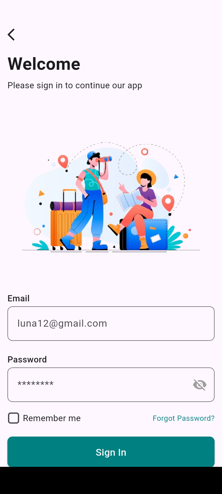
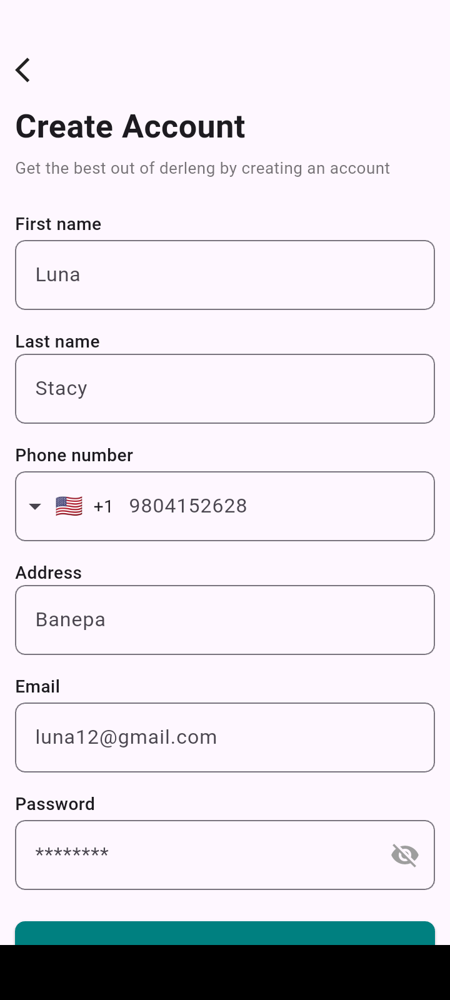
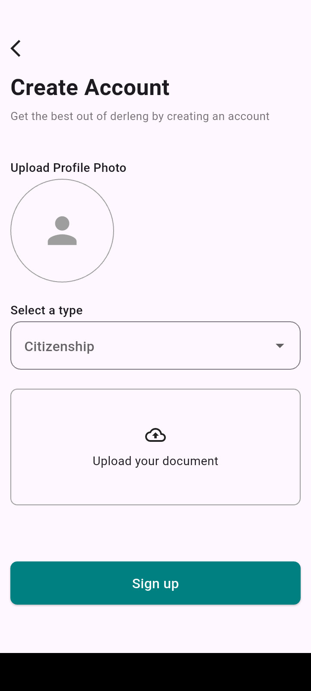

# 🚀 Yatra — Flutter Firebase Authentication App


**Yatra** is a Flutter mobile application that demonstrates **Firebase Authentication** and **Cloud Firestore integration** using clean and scalable Flutter development practices.

This project is built as a **portfolio project for a fresher Flutter developer**, showcasing real-world authentication flow, backend integration, and clean UI design.

---

## ✨ Features

- Email & Password authentication using Firebase
- User registration and login
- Secure authentication flow
- Firestore integration for storing user data
- Form validation with error handling
- Clean and responsive UI
- Scalable project structure

---

## 🧱 Architecture

The project follows a **layered Flutter architecture**:

- **Presentation Layer** → UI screens & widgets  
- **Logic Layer** → Authentication & state handling  
- **Data Layer** → Firebase Authentication & Firestore  

This structure makes the app easy to maintain and extend.

---

## 🔧 Tech Stack

- Flutter
- Dart
- Firebase Authentication
- Cloud Firestore
- Provider / State handling
- Git & GitHub

---

## 🌐 Firebase Services Used

- Firebase Authentication (Email & Password)
- Cloud Firestore (User data storage)

---

## 🚀 Getting Started

### 1️⃣ Clone the repository
```bash
git clone https://github.com/Chorusraj/Yatra.git
cd Yatra
```

### 2️⃣ Install dependencies
```bash
flutter pub get
```

### 3️⃣ Firebase Setup
``` bash
Go to https://console.firebase.google.com

Create a new Firebase project

Enable Email/Password Authentication

Create a Cloud Firestore database

Add Android/iOS app in Firebase settings

Download:

google-services.json → android/app/

GoogleService-Info.plist → ios/Runner/
```

### 4️⃣ Run the app
``` bash
flutter run
```

---

## 📸 Screenshots

### Login Screen


### Signup Screen


### Signup Screen 2


### Onboarding Screen


> Make sure your screenshots are placed in the `screenshots/` folder at the repo root.

---

## 📁 Project Structure

```

lib/
├─ main.dart
├─ screens/
│   ├─ login_page.dart
│   ├─ register_page.dart
│   └─ home_page.dart
├─ services/
│   ├─ auth_service.dart
│   └─ firestore_service.dart
assets/
├─ screenshots/
pubspec.yaml
```
---

## 📝 Notes

- Firebase configuration is required before running the app
- Firestore stores authenticated user data
- Clean UI with proper form validation
- Easy to extend with more features

---

## 🔮 Future Enhancements

- Google Sign-In
- User profile page
- Firebase Storage (profile images)
- Logout & session persistence
- BLoC state management
-Unit testing

---

## 👨‍💻 Author

**Chorus Rajbanshi** - Flutter Developer (Fresher)

- GitHub: [https://github.com/Chorusraj]
- LinkedIn: [https://www.linkedin.com/in/chorus-rajbanshi-32ba7a330/]